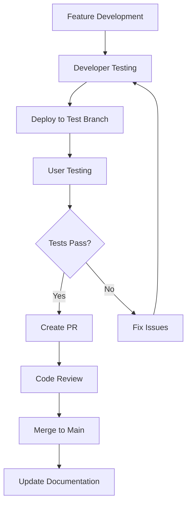

# Helios Trading Bot - Claude AI Context Document

## 🚨 CRITICAL: ALL RULES ARE ABSOLUTE AND MANDATORY 🚨

This document provides comprehensive context for AI assistants working on the **Helios Trading Bot** project. Every rule and guideline must be followed without exception.

## Project Overview

**Helios Trading Bot** is a sophisticated cryptocurrency trading bot implementing a **Signal-Driven Dynamic Grid Trading** strategy. This is financial software targeting aggressive growth (30-40% monthly returns) with comprehensive risk management and security measures.

### Current Status: Phase 1.5 - Foundational Improvements

**Current Branch**: `feat/phase-1.5-improvements`

#### Completed Phases ✅
- **Phase 1.1**: Environment setup & configuration system
- **Phase 1.2**: Binance API integration with secure authentication
- **Phase 1.3**: Multi-tier data pipeline (PostgreSQL, Redis, R2)
- **Phase 1.4**: Signal generation engine using Polars

#### Phase 1.5 Goals (IN PROGRESS) 🔄
1. **Automate Rules**: Implement pre-commit hooks for `black` and `ruff`
2. **Optimize DB Inserts**: Refactor to use batch `executemany` operations
3. **Improve Tests**: Mock `BinanceClient` for faster, more reliable tests
4. **Refine Architecture**: Resolve circular dependencies and magic strings

## 🚨 ABSOLUTE MANDATORY RULES 🚨

### Rule 1: CHANGE TRACKING IS MANDATORY
**BEFORE any change**: Review `docs/CHANGELOG.md` and `PROJECT_STATUS.md`
**AFTER any change**: Update `docs/CHANGELOG.md` and `PROJECT_STATUS.md` immediately

### Rule 2: GIT BRANCH PROTECTION - NEVER PUSH TO MAIN
- **FORBIDDEN**: `git push origin main` or any direct push to main
- **REQUIRED**: Always use feature branches (`feat/`, `fix/`, `docs/`, `arch/`)
- **WORKFLOW**: Feature branch → Push → Create PR → Merge

### Rule 3: PHASED DEVELOPMENT - MANDATORY USER TESTING
- **Maximum 3 days** per development phase
- **Single feature focus** per phase
- **Deploy → User Test → Approval → Merge** workflow
- **No direct merges** without user testing approval
- **Quality gates** at every phase

### Rule 4: FINANCIAL SECURITY FIRST
- **API Keys**: Environment variables only, NEVER in code
- **Decimal Precision**: Use `Decimal` type for all financial calculations
- **Input Validation**: Validate ALL market data and financial inputs
- **Risk Limits**: Enforce risk limits at multiple levels
- **Testnet Only**: Development on Binance testnet only

### Rule 5: CODE QUALITY STANDARDS
- **Black formatting**: 88 character line length
- **Ruff linting**: Auto-fixes enabled
- **Type hints**: Comprehensive typing throughout
- **Error handling**: Comprehensive exception handling
- **Testing**: >90% coverage for implemented components

## Phased Development Process (MANDATORY)

### Development Workflow


### Developer Responsibilities (AI Assistant)
- [ ] **Feature Implementation**: Write code following all rules
- [ ] **Unit Testing**: Comprehensive tests for all code
- [ ] **Documentation**: Update all relevant documentation
- [ ] **Integration Testing**: Ensure compatibility with existing components
- [ ] **Deploy to Test Branch**: Create testable deployment
- [ ] **Bug Fixes**: Address issues from user testing

### User Responsibilities (Project Owner)
- [ ] **Feature Testing**: Test deployed features thoroughly
- [ ] **Validation**: Confirm feature meets requirements
- [ ] **Feedback**: Provide clear feedback on issues
- [ ] **Approval**: Give explicit approval before merge
- [ ] **Environment Setup**: Provide API keys and test access

### Phase Size Guidelines
- **Low Risk** (1-2 days): Documentation, configuration, utilities
- **Medium Risk** (2-3 days): API integration, data validation, testing
- **High Risk** (Max 3 days): Trading logic, risk management, financial calculations

## Architecture Overview

### Core Components
```
src/
├── api/           # Binance API integration (✅ COMPLETE)
│   ├── binance_client.py    # Secure API client with rate limiting
│   ├── exceptions.py        # Comprehensive error handling
│   ├── models.py           # Type-safe data models
│   └── rate_limiter.py     # Sophisticated rate limiting
├── core/          # Configuration & environment (✅ COMPLETE)
│   ├── config.py           # Secure configuration management
│   └── environment.py      # Environment validation
├── data/          # Multi-tier data pipeline (✅ COMPLETE)
│   ├── connection_managers.py  # PostgreSQL, Redis, R2 managers
│   ├── database_schema.py     # Production database schema
│   └── market_data_pipeline.py # Complete data flow orchestration
├── strategies/    # Signal generation (✅ BASIC COMPLETE)
│   ├── signal_generator.py    # EMA crossover signals
│   └── technical_analysis.py  # Technical indicators
├── utils/         # Utilities (✅ COMPLETE)
│   └── logging.py          # Trading-specific logging
├── risk/          # Risk management (📋 PLANNED)
└── backtest/      # Backtesting framework (📋 PLANNED)
```

### Technology Stack
- **Language**: Python 3.11+ with modern packaging (pyproject.toml, UV support)
- **Exchange**: Binance (testnet for development, production-ready)
- **Databases**: PostgreSQL (Neon), Redis (Upstash), R2 (Cloudflare)
- **Data Processing**: Polars for high-performance analytics
- **Testing**: pytest with integration and unit tests
- **Code Quality**: Black, Ruff, pre-commit hooks

### Data Pipeline Architecture
**Multi-tier storage strategy:**
- **Hot Data**: Redis (real-time prices, 5-10 min TTL)
- **Warm Data**: PostgreSQL (current prices, OHLCV data with dedicated `helios_trading` schema)
- **Cold Data**: R2/S3 (historical archives in Parquet format)
- **Metadata**: PostgreSQL (data quality metrics, trading sessions)

## Trading Strategy: Signal-Driven Dynamic Grid

### Core Innovation
1. **Signal Analysis**: EMA crossover detection using Polars
2. **Entry Conditions**: Only trade when market conditions are optimal
3. **Grid Dynamics**: ATR-based grid spacing that adapts to volatility
4. **Risk Management**: Multi-layer protection with circuit breakers

### Risk Parameters
- **Maximum Position**: $100 USD per trade
- **Daily Loss Limit**: $50 USD
- **Account Drawdown**: 25% circuit breaker
- **Grid Levels**: 10 levels with 1% spacing (configurable)

## 🔒 Security & Financial Safety (CRITICAL)

### API Key Protection (ABSOLUTE RULES)
```python
# ✅ CORRECT: Environment-based
api_key = os.getenv("BINANCE_API_KEY")

# ❌ FORBIDDEN: Hardcoded credentials
api_key = "your_key_here"  # NEVER DO THIS
```

### Financial Data Validation (MANDATORY)
```python
# ✅ REQUIRED: Decimal precision for money
from decimal import Decimal
position_size = Decimal(str(balance)) * Decimal(str(risk_percent))

# ❌ FORBIDDEN: Float arithmetic for money
position_size = balance * 0.01  # Can cause precision errors
```

### Risk Management (MANDATORY)
```python
def validate_new_position(proposed_size: float, current_balance: float,
                        initial_balance: float, daily_pnl: float) -> bool:
    """Comprehensive risk validation before opening position"""

    # 1. Position size validation
    max_allowed = current_balance * self.max_position_size
    if proposed_size > max_allowed:
        raise RiskLimitExceeded(f"Position size {proposed_size} > max {max_allowed}")

    # 2. Drawdown check
    drawdown = (initial_balance - current_balance) / initial_balance
    if drawdown >= self.max_drawdown:
        raise DrawdownLimitExceeded(f"Drawdown {drawdown:.2%} >= limit")

    return True
```

## Development Workflow (MANDATORY)

### Git Workflow
```bash
# 1. ALWAYS start with feature branch
git checkout -b feat/phase-X-feature-name

# 2. Make changes and commit
git add .
git commit -m "descriptive message"

# 3. Push feature branch (NEVER main)
git push origin feat/phase-X-feature-name

# 4. Deploy for user testing
# 5. Get user approval
# 6. Create PR only after approval
gh pr create --title "Feature" --body "Description"
```

### Quality Gates (MANDATORY)

#### Before User Testing
- [ ] All unit tests pass
- [ ] Integration tests pass
- [ ] Code follows all style rules
- [ ] Documentation updated
- [ ] Security checklist complete

#### Before Merge to Main
- [ ] User testing complete and approved
- [ ] All issues resolved
- [ ] CHANGELOG.md updated
- [ ] PROJECT_STATUS.md updated
- [ ] PR documentation complete

### Code Quality Checks
```bash
# Format code
uv run black src tests

# Lint code
uv run ruff check src tests --fix

# Type checking
uv run mypy src

# Run tests
uv run pytest
```

### Change Documentation (MANDATORY)
**EVERY change must update:**
- `docs/CHANGELOG.md` - Detailed change history
- `PROJECT_STATUS.md` - Current project state
- Relevant documentation files

## Environment Setup

### Prerequisites
- Python 3.11+
- UV package manager (recommended) or pip
- Binance testnet API keys
- PostgreSQL (Neon), Redis (Upstash), R2 (Cloudflare) credentials

### Configuration (.env file)
```bash
# Binance API (testnet only for development)
BINANCE_API_KEY=your_testnet_key
BINANCE_API_SECRET=your_testnet_secret
BINANCE_TESTNET=true

# PostgreSQL (Neon)
NEON_HOST=your_host
NEON_DATABASE=your_db
NEON_USERNAME=your_user
NEON_PASSWORD=your_password

# Redis (Upstash)
UPSTASH_REDIS_HOST=your_host
UPSTASH_REDIS_PASSWORD=your_password

# R2 (Cloudflare)
R2_ACCOUNT_ID=your_account_id
R2_ACCESS_KEY=your_access_key
R2_SECRET_KEY=your_secret_key
R2_BUCKET_NAME=your_bucket
```

## Key Commands

### Development
```bash
# Setup environment
python3 scripts/setup_dev_environment.py

# Test environment
python3 scripts/test_environment.py

# Test API connection
python3 scripts/test_api_connection.py

# Test data pipeline
python3 scripts/test_data_pipeline.py
```

### Pre-commit Setup (Phase 1.5 Goal)
```bash
# Install pre-commit hooks
pre-commit install

# Run hooks manually
pre-commit run --all-files
```

## Testing Strategy

### Test Categories
- **Unit Tests**: Core logic, configuration, utilities
- **Integration Tests**: API connectivity, data pipeline
- **Mock Strategy**: BinanceClient mocked for reliable tests
- **Coverage**: >90% for implemented components

### Test Commands
```bash
# Run all tests
uv run pytest

# Run without integration tests
uv run pytest -m "not integration"

# Run with coverage
uv run pytest --cov=src
```

## Phase 1.5 Specific Tasks

### 1. Pre-commit Hooks (High Priority)
- ✅ Configuration exists in `.pre-commit-config.yaml`
- 🔄 Ensure hooks are installed and working
- 🎯 Goal: Automatic code quality enforcement

### 2. Database Optimization (Medium Priority)
- 🔄 Refactor `_store_ohlcv_data()` in `src/data/market_data_pipeline.py:321`
- 🎯 Goal: Use batch `executemany` for historical data inserts
- 📍 Location: `market_data_pipeline.py:368-375`

### 3. Test Mocking (Medium Priority)
- 🔄 Mock `BinanceClient` in integration tests
- 🎯 Goal: Faster, more reliable tests independent of API
- 📍 Location: `tests/integration/test_api_integration.py`

### 4. Architecture Cleanup (Medium Priority)
- 🔄 Create constants module for magic strings
- 🔄 Review and resolve any circular dependencies
- 🎯 Goal: Cleaner, more maintainable codebase

## File Structure Importance

### Critical Files (Never modify without understanding)
- `src/core/config.py`: Configuration management system
- `src/api/binance_client.py`: Secure API client
- `src/data/market_data_pipeline.py`: Complete data flow
- `src/data/connection_managers.py`: Multi-service connections
- `pyproject.toml`: Python packaging and tool configuration

### Documentation Files (Must be kept updated)
- `PROJECT_STATUS.md`: Current project state (update after every change)
- `docs/CHANGELOG.md`: Change tracking (update after every change)
- `README.md`: User-facing setup instructions
- `docs/DEVELOPMENT_WORKFLOW.md`: Development process

## Communication Protocol

### During Development
- **Daily Updates**: Brief status on progress
- **Blocker Communication**: Immediate notification of blockers
- **Question Escalation**: Quick clarification on requirements

### During Testing
- **Clear Test Instructions**: What and how to test
- **Issue Reporting**: Detailed problem descriptions
- **Approval Process**: Explicit approval or rejection with reasons

### User Approval Requirements
Before any merge to main:
- [ ] **Explicit User Approval**: "Approved for merge" statement
- [ ] **Testing Confirmation**: User confirms feature works
- [ ] **Issue Resolution**: All issues resolved
- [ ] **Documentation Review**: Documentation adequate

## Common Issues & Solutions

### API Connection Issues
- Verify `BINANCE_TESTNET=true` in environment
- Confirm testnet keys from testnet.binance.vision
- Check API key format (should be 64+ characters)

### Database Issues
- Verify all database credentials in .env
- Check `helios_trading` schema exists (auto-created)
- Ensure network connectivity to cloud services

### Test Issues
- Integration tests require valid API credentials
- Use `pytest -m "not integration"` to skip API tests
- Ensure mock tests run without external dependencies

## Emergency Procedures

### If Critical Issues Found
1. **Immediate Stop**: Halt all development on current phase
2. **Issue Analysis**: Understand root cause and impact
3. **Fix Implementation**: Address issue with highest priority
4. **Re-testing**: Complete testing cycle again
5. **Documentation**: Update all relevant documentation

### If User Unavailable for Testing
- **Maximum 2 day wait** for user testing feedback
- **Clear communication** about availability
- **Alternate testing approach** if extended unavailability

## Performance Considerations

### Current Optimizations
- **Connection Pooling**: Async HTTP and database connections
- **Batch Operations**: Efficient multi-symbol API calls
- **Caching Strategy**: Redis for hot data, PostgreSQL for persistence
- **Rate Limiting**: Sophisticated rate limiting respecting Binance limits

### Phase 1.5 Improvements
- Database batch inserts for historical data (reduces round-trips)
- Test mocking for faster test execution
- Constants module for reduced magic strings

## Next Phases Preview

### Phase 2: Technical Analysis Engine
- Advanced technical indicators beyond EMA
- ATR-based volatility calculation
- Multi-timeframe signal analysis

### Phase 3: Grid Trading Logic
- Dynamic grid level calculation
- Order placement and management
- Position sizing algorithms

### Phase 4: Risk Management
- Real-time risk monitoring
- Circuit breaker implementation
- Portfolio-level risk controls

## 🚨 CRITICAL REMINDERS FOR AI ASSISTANT 🚨

### Financial Safety
1. **This is financial software** - security and precision are paramount
2. **Use Decimal types** for all monetary calculations
3. **Validate all inputs** especially market data and financial parameters
4. **Testnet only** for development - never suggest live trading modifications

### Phased Development (MANDATORY)
1. **Maximum 3 days per phase** - never exceed this
2. **Deploy → User Test → Approval → Merge** - never skip user testing
3. **Single feature focus** - no mixing features in phases
4. **Explicit approval required** before any merge to main

### Git Workflow
1. **NEVER push to main** - always use feature branches
2. **Always create PRs** for code changes
3. **Update documentation** after every change
4. **Follow branch naming** conventions (feat/, fix/, docs/, arch/)

### Code Quality
1. **Follow Black/Ruff** standards automatically
2. **Use comprehensive type hints** throughout
3. **Implement proper error handling** for all edge cases
4. **Maintain test coverage** >90% for new code

### Change Tracking
1. **Review CHANGELOG.md** before starting work
2. **Update CHANGELOG.md** immediately after changes
3. **Update PROJECT_STATUS.md** to reflect current state
4. **Document context and reasoning** for all changes

### Testing Requirements
1. **All changes must be tested** with comprehensive test cases
2. **Integration tests** for API and database interactions
3. **Unit tests** for business logic and calculations
4. **Mock external dependencies** for reliable testing

## Success Metrics

### Development Quality
- **Zero critical bugs** in merged features
- **Complete test coverage** for all financial code
- **Documentation quality** maintained throughout

### Process Efficiency
- **Phase completion time** within estimates
- **User testing turnaround** within 24-48 hours
- **Issue resolution time** minimized

### Financial Safety
- **Risk validation** for all trading-related features
- **Security compliance** for all implementations
- **Audit trail** maintained for all financial operations

## Contact & Support

This is a personal trading project focused on aggressive growth strategies with professional-grade development standards. The codebase follows financial software best practices with comprehensive security, testing, and documentation requirements.

**Environment**: Development (Binance Testnet Only)
**Version**: 1.5.0 (in development - Phase 1.5)
**Last Updated**: 2025-01-07

---

**⚠️ REMEMBER: These rules exist to maintain financial safety and software excellence. The phased development approach with mandatory user testing ensures quality and prevents costly mistakes in financial software. They must never be bypassed or ignored.**
