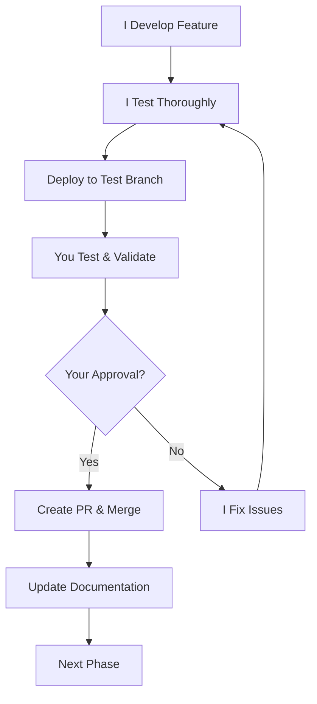

# Helios Trading Bot - Complete Project Overview & Next Steps

## 📊 **Current Project State**

### ✅ **Phase 0: Complete (Project Foundation)**
We have successfully established a **professional-grade trading bot development framework**:

#### **🏗️ Project Structure**
```
binance-bot/
├── src/                    # Source code (ready for implementation)
├── tests/                  # Testing framework (structured)
├── local/                  # Internal docs & data (git-ignored)
├── docs/                   # Public documentation
├── .cursor/rules/          # Comprehensive development rules
└── [config files]          # Requirements, gitignore, etc.
```

#### **📋 Rules Framework (11 Comprehensive Rules)**
1. **Python Code Style** - Black formatting, imports, naming
2. **Documentation Standards** - API docs, architecture docs
3. **Security & Financial Safety** - API keys, financial data validation
4. **PR Process** - Architecture diagrams, impact analysis
5. **Change Impact Tracking** - System visualization, dependencies
6. **API Evolution Tracking** - Version management, compatibility
7. **Testing & Quality** - Backtesting, risk testing, validation
8. **Change Tracking (MANDATORY)** - CHANGELOG.md, PROJECT_STATUS.md
9. **Git Branch Protection** - Feature branch workflow, no direct main pushes
10. **Trading Bot Specific** - Financial precision, risk management code
11. **Phased Development** - User testing, feature approval process

#### **📚 Complete Documentation**
- ✅ **Strategic Analysis**: Trading strategy deep-dive
- ✅ **Technical Design**: Architecture and system design
- ✅ **Risk Management**: Comprehensive financial safety framework
- ✅ **Development Roadmap**: 6-phase implementation plan
- ✅ **Requirements Analysis**: User profile and requirements
- ✅ **Environment Setup**: Complete setup guide
- ✅ **Development Workflow**: Git workflow and PR process
- ✅ **Phased Development**: Testing and approval framework

## 🎯 **Unique Trading Strategy: Signal-Driven Dynamic Grid**

### **Innovation**
Unlike standard trading bots, Helios combines:
- **Intelligent Entry**: Only trades when market conditions are optimal
- **Dynamic Grid**: ATR-based grid sizing that adapts to volatility
- **Smart Risk Management**: Multi-layer protection with circuit breakers

### **Target Performance**
- **Realistic**: 5-15% monthly returns with 65-75% win rate
- **Aggressive**: 20-35% monthly returns (high risk)
- **Risk Management**: 1% risk per trade, 25% max drawdown limit

## 🚀 **Ready for Implementation: Phase 1**

### **Phase 1 Goals (3 days)**
**Foundation Setup**: Environment, API integration, basic data pipeline

### **What I Need From You**

#### **🔑 Critical: API Keys (Required to Start)**
1. **Create Binance Testnet Account**:
   - Go to https://testnet.binance.vision/
   - Create account and generate API key/secret
   - **Share keys securely** with me

2. **Confirm Environment**:
   - macOS system (confirmed from your paths)
   - Python 3.9+ available
   - Testing availability (24-48 hour turnaround)

#### **📋 Your Testing Responsibilities**
For each Phase 1 deliverable:
- [ ] **Test functionality** works as described
- [ ] **Report issues** clearly and promptly
- [ ] **Provide explicit approval** before merge to main
- [ ] **Confirm usability** and documentation quality

### **What I Will Deliver**

#### **Day 1: Environment Setup & Configuration**
**Branch**: `feat/phase-1-1-environment-setup`
- Environment setup and validation scripts
- Secure configuration management system
- Basic project infrastructure and logging
- **Your Test**: Run setup scripts, verify environment

#### **Day 2: API Integration**
**Branch**: `feat/phase-1-2-api-integration`
- Binance API client with security controls
- Connection management and error handling
- Basic operations (account info, prices)
- **Your Test**: Verify API connection with your credentials

#### **Day 3: Data Pipeline Foundation**
**Branch**: `feat/phase-1-3-data-pipeline`
- Market data fetching for 3-5 trading pairs
- Data validation and secure storage
- Real-time price monitoring
- **Your Test**: Confirm data fetching and storage works

## 🔄 **Our Development Process**

### **Phased Development Workflow**


### **Quality Assurance**
- **Maximum 3 days** per phase
- **Single feature focus** per phase
- **Comprehensive testing** at each step
- **Explicit approval** required before merge
- **Complete documentation** maintained

## 📊 **Project Timeline**

### **Immediate (Next 3 days - Phase 1)**
- **Foundation Setup**: Environment, API, basic data pipeline
- **Deliverable**: Working Binance connection and market data fetching

### **Phase 2 (Days 4-7)**
- **Technical Analysis Engine**: ATR calculations, signal generation
- **Indicator Systems**: Moving averages, volume analysis
- **Signal Framework**: Entry/exit signal logic

### **Phase 3 (Days 8-12)**
- **Grid Trading Engine**: Dynamic grid calculations
- **Order Management**: Position sizing and order placement
- **Session Management**: Grid deployment and monitoring

### **Phase 4 (Days 13-16)**
- **Risk Management**: Position validation, drawdown protection
- **Safety Systems**: Emergency shutdown, circuit breakers
- **Monitoring Dashboard**: Real-time risk metrics

### **Phase 5 (Days 17-21)**
- **Backtesting Framework**: Historical validation
- **Performance Analysis**: Strategy optimization
- **Walk-forward Testing**: Overfitting prevention

### **Phase 6 (Days 22-28)**
- **Paper Trading**: Live market simulation
- **Production Preparation**: Security audit, deployment
- **Live Trading Ready**: Gradual capital deployment

## 🔒 **Financial Safety Framework**

### **Security Standards**
- **No hardcoded credentials** - Environment variables only
- **Decimal precision** for all financial calculations
- **Comprehensive validation** for all market data
- **Complete audit trail** for all trading decisions

### **Risk Management**
- **1% maximum risk** per grid session
- **25% account drawdown** circuit breaker
- **Daily loss limits** with cooling-off periods
- **Position size validation** at multiple levels

### **Testing Requirements**
- **Paper trading mandatory** before live deployment
- **Backtesting validation** for all strategy changes
- **Risk scenario testing** for edge cases
- **User approval required** for all financial features

## 📈 **Success Metrics**

### **Phase 1 Success**
- [ ] Environment setup works flawlessly on your machine
- [ ] API connection stable and secure
- [ ] Market data fetching operational for 3-5 pairs
- [ ] All tests pass with >90% coverage
- [ ] You can run and understand all components

### **Project Success (Long-term)**
- **Backtesting**: Sharpe ratio >1.2, Max drawdown <15%
- **Paper Trading**: Performance within 10% of backtest
- **Risk Compliance**: 100% adherence to risk rules
- **System Reliability**: 99.9% uptime during trading

## 🔧 **Technical Excellence**

### **Code Quality Standards**
- **Black formatting** for all Python code
- **Type hints** throughout codebase
- **Comprehensive error handling** and logging
- **Security-first development** approach

### **Architecture Principles**
- **Modular design** with clear separation of concerns
- **Event-driven architecture** for real-time processing
- **Scalable foundation** for platform growth
- **Financial-grade reliability** and validation

## 💬 **Communication Protocol**

### **Daily Updates (During Development)**
- **Morning**: Development plan and priorities
- **Midday**: Progress update and any blockers
- **Evening**: Deliverable ready for your testing

### **Testing Communication**
- **Clear instructions** on what and how to test
- **Prompt feedback** on issues or approval
- **Detailed issue reporting** if problems found

## 🚨 **Critical Financial Reminders**

⚠️ **HIGH RISK**: 30-40% monthly return targets carry significant risk
⚠️ **TESTNET ONLY**: All development uses Binance testnet (no real money)
⚠️ **PAPER TRADING**: Mandatory before any live trading
⚠️ **CAPITAL PROTECTION**: Never risk more than you can afford to lose

---

## 🎯 **Ready to Launch Phase 1?**

### **Your Action Items**
1. **✅ Set up Binance testnet** account and generate API keys
2. **✅ Share API keys** with me securely
3. **✅ Confirm testing availability** (24-48 hour feedback)
4. **✅ Review this overview** and ask any questions

### **My Commitment**
- **High-quality code** following all established standards
- **Comprehensive testing** before your review
- **Clear documentation** for everything delivered
- **Responsive communication** throughout development
- **Financial safety first** in all implementations

**Once you provide the API keys and confirm readiness, I'll immediately begin Phase 1.1!**

The foundation we build together will determine the success of your Helios Trading Bot. Let's make it exceptional! 🚀💰
