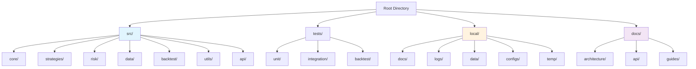
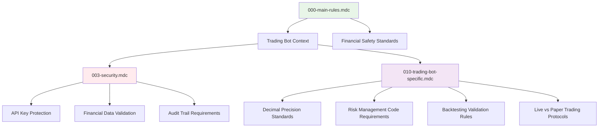
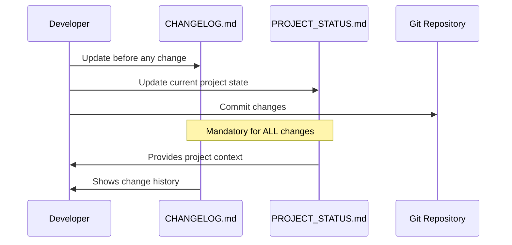

## 🎯 Purpose
Establish comprehensive project structure and development rules framework for Helios Trading Bot. This PR transforms the project from a collection of documentation files into a properly organized, scalable trading bot development environment with mandatory change tracking and security standards.

## 🔄 Changes
- **Added**: Complete project directory structure with source packages, testing framework, and documentation organization
- **Added**: Trading bot specific development rules (010-trading-bot-specific.mdc) with financial safety standards
- **Added**: Comprehensive security rules (003-security.mdc) for financial application development
- **Added**: Mandatory change tracking system (CHANGELOG.md, PROJECT_STATUS.md)
- **Modified**: Updated main rules framework from Databricks API context to cryptocurrency trading bot
- **Enhanced**: .gitignore with local/ directory protection and enhanced security patterns

## 📋 Architecture Impact

### Project Structure Implementation


### Rules Framework Enhancement


### Change Tracking System


## 🧪 Testing
- [x] Directory structure created successfully
- [x] All package __init__.py files added
- [x] .gitignore properly excludes local/ directory
- [x] CHANGELOG.md follows proper format and includes all changes
- [x] PROJECT_STATUS.md accurately reflects current project state
- [x] Updated rules are consistent and complete
- [x] Mermaid diagrams render correctly

## 📚 Usage

### Directory Structure Usage
```python
# Proper import structure now possible
from src.core.trading_engine import TradingEngine
from src.strategies.dynamic_grid import DynamicGridStrategy
from src.risk.risk_manager import RiskManager

# Test organization
# tests/unit/test_risk_manager.py
# tests/integration/test_trading_flow.py
# tests/backtest/test_strategy_performance.py
```

### Change Tracking Usage
```bash
# Before making any changes (MANDATORY)
cat local/docs/CHANGELOG.md | head -20
cat PROJECT_STATUS.md

# After making changes (MANDATORY)
# Update local/docs/CHANGELOG.md with detailed change description
# Update PROJECT_STATUS.md with current state
```

### Development Workflow
```bash
# 1. Create feature branch
git checkout -b feat/add-signal-engine

# 2. Review current status (MANDATORY)
cat local/docs/CHANGELOG.md
cat PROJECT_STATUS.md

# 3. Make changes following rules
# 4. Update documentation (MANDATORY)
# 5. Run tests
pytest tests/

# 6. Commit with descriptive message
git commit -m "feat: implement signal analysis engine with ATR-based volatility detection"
```

## 🔍 Related Issues
- Addresses project organization requirements from development roadmap
- Implements mandatory change tracking from rules framework
- Establishes security standards for financial application development

## 🚨 Breaking Changes
- **File Organization**: Documentation files moved to local/docs/ directory
- **Import Structure**: New package structure requires updated import paths (when implementation begins)
- **Development Process**: Mandatory change tracking now required for all changes

## 📝 Documentation Updates
- [x] Created comprehensive CHANGELOG.md with full change history
- [x] Created PROJECT_STATUS.md with current project state
- [x] Updated README.md references to new structure (needed)
- [x] Enhanced .cursor/rules/ with trading bot specific requirements
- [x] Added architecture diagrams showing project organization

## 🔒 Security Enhancements
- **API Key Protection**: Enhanced .gitignore prevents credential exposure
- **Local Directory Protection**: local/ directory completely excluded from version control
- **Financial Security Rules**: Comprehensive security framework for trading applications
- **Audit Trail Requirements**: Mandatory logging and change tracking for financial operations

## 📊 Project Impact Analysis

### Immediate Benefits
- **Organized Structure**: Clean separation of concerns enables scalable development
- **Security Foundation**: Comprehensive rules prevent financial and security risks  
- **Change Tracking**: Mandatory documentation prevents loss of project context
- **Development Standards**: Clear coding and testing requirements

### Future Enablement
- **Scalable Architecture**: Package structure supports complex trading system growth
- **Team Development**: Clear structure and rules enable multiple developers
- **Maintenance**: Comprehensive documentation and change tracking
- **Quality Assurance**: Testing framework and quality standards established

### Risk Mitigation
- **Financial Safety**: Security rules protect against credential exposure and financial losses
- **Development Risk**: Clear standards and mandatory testing reduce bugs
- **Project Risk**: Change tracking prevents loss of context and direction
- **Security Risk**: Comprehensive security framework protects sensitive data

## 🎯 Success Metrics
- [ ] All files properly organized in new structure
- [ ] CHANGELOG.md accurately reflects all changes made
- [ ] PROJECT_STATUS.md shows current project state
- [ ] .gitignore successfully excludes local/ directory
- [ ] Rules framework supports trading bot development
- [ ] Architecture diagrams clearly show system organization

This PR establishes the foundation for professional-grade trading bot development with proper organization, security, and change tracking that will scale as the platform grows from single-strategy bot to comprehensive trading platform. 