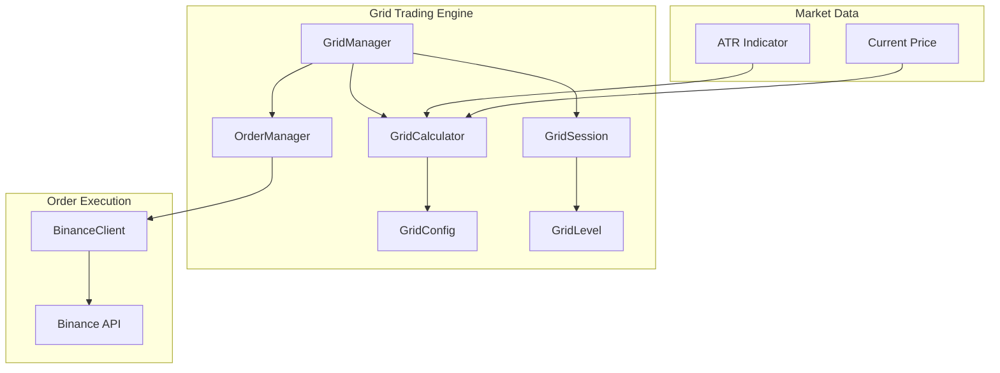
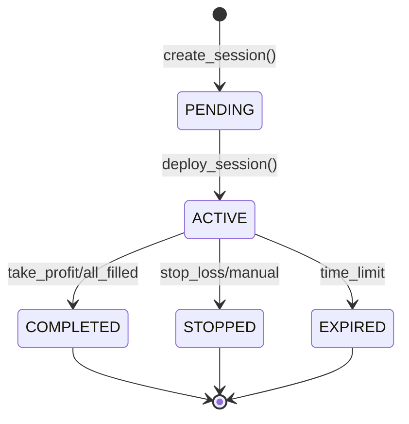

# Grid Trading API Documentation

## Overview

The Grid Trading module implements Helios's **Signal-Driven Dynamic Grid Trading** strategy. Unlike static grid bots, this system:

1. Only deploys grids when market conditions are optimal
2. Dynamically adjusts grid parameters based on real-time ATR (volatility)
3. Integrates with the signal engine for intelligent entry timing

## Architecture



## Core Components

### GridConfig

Configuration for grid trading sessions.

```python
from decimal import Decimal
from src.trading import GridConfig

config = GridConfig(
    symbol="BTCUSDT",
    grid_levels=8,                    # Total grid levels (4 buy + 4 sell)
    range_multiplier=Decimal("2.0"),  # ATR multiplier for grid range
    risk_per_session=Decimal("0.01"), # 1% of capital per session
    max_position_size=Decimal("0.05"),# 5% max position
    max_session_duration_hours=4,     # Auto-exit after 4 hours
    take_profit_percent=Decimal("0.03"),  # 3% profit target
    stop_loss_percent=Decimal("0.02"),    # 2% below grid bottom
)

# Validate configuration
errors = config.validate()
if errors:
    print(f"Configuration errors: {errors}")
```

### GridCalculator

Calculates dynamic grid parameters based on market volatility.

```python
from decimal import Decimal
from src.trading import GridCalculator, GridConfig

config = GridConfig(symbol="BTCUSDT", grid_levels=8)
calculator = GridCalculator(config)

# Calculate grid from current market conditions
result = calculator.calculate_grid(
    current_price=Decimal("50000"),
    atr_value=Decimal("1000"),      # 14-period ATR
    available_capital=Decimal("10000"),
    price_precision=2,
    quantity_precision=5,
)

if result.success:
    session = result.session
    print(f"Grid range: {session.lower_bound} - {session.upper_bound}")
    print(f"Grid spacing: {session.grid_spacing}")
    print(f"Stop-loss: {session.stop_loss_price}")
else:
    print(f"Error: {result.error_message}")
```

### GridSession

Tracks a complete grid trading session.

```python
from src.trading import GridSession, GridStatus

# Session properties
session = result.session

# Grid bounds (calculated from ATR)
print(f"Entry: {session.entry_price}")
print(f"Upper bound: {session.upper_bound}")
print(f"Lower bound: {session.lower_bound}")
print(f"Spacing: {session.grid_spacing}")

# Capital allocation
print(f"Allocated capital: {session.allocated_capital}")
print(f"Order size per level: {session.order_size_per_level}")

# Access grid levels
for level in session.buy_levels:
    print(f"Buy level {level.level_index}: {level.price}")
for level in session.sell_levels:
    print(f"Sell level {level.level_index}: {level.price}")

# Session lifecycle
session.start()  # Begin trading
session.stop("Reason")  # Manual stop
session.complete()  # Target reached
session.expire()  # Time limit

# P&L tracking
session.update_pnl(current_price=Decimal("51000"))
print(f"Realized P&L: {session.realized_pnl}")
print(f"Unrealized P&L: {session.unrealized_pnl}")
print(f"Total P&L: {session.total_pnl}")
print(f"Win rate: {session.win_rate}%")
```

### GridLevel

Individual level within a trading grid.

```python
from src.trading import GridLevel, GridSide, GridLevelStatus

# Level properties
level = session.buy_levels[0]
print(f"Price: {level.price}")
print(f"Quantity: {level.quantity}")
print(f"Side: {level.side}")  # GridSide.BUY or GridSide.SELL
print(f"Status: {level.status}")

# Level status progression:
# PENDING -> OPEN -> BUY_FILLED -> SELL_FILLED (complete cycle)

# After buy fills
level.mark_buy_filled(
    fill_price=Decimal("49000"),
    fill_time=datetime.now(timezone.utc),
)

# After sell fills (returns realized P&L)
pnl = level.mark_sell_filled(
    fill_price=Decimal("50000"),
    fill_time=datetime.now(timezone.utc),
    commission=Decimal("0.5"),
)
print(f"Level P&L: {pnl}")
```

### GridManager

Orchestrates grid trading sessions.

```python
from src.trading import GridManager, GridConfig, OrderManager

# Initialize with order manager
order_manager = OrderManager(client=binance_client, config=trading_config)
grid_manager = GridManager(
    order_manager=order_manager,
    default_config=GridConfig(symbol="BTCUSDT"),
)

# Create a grid session
session = await grid_manager.create_session(
    symbol="BTCUSDT",
    current_price=Decimal("50000"),
    atr_value=Decimal("1000"),
    available_capital=Decimal("10000"),
)
print(f"Session ID: {session.session_id}")

# Deploy the grid (places all orders)
deployed = await grid_manager.deploy_session(session.session_id)
print(f"Status: {deployed.status}")  # GridStatus.ACTIVE

# Handle order fill events
await grid_manager.handle_order_fill(
    order_id="order-123",
    fill_price=Decimal("49000"),
    fill_quantity=Decimal("0.01"),
    commission=Decimal("0.5"),
)

# Monitor session conditions
result = await grid_manager.check_session_conditions(
    session_id=session.session_id,
    current_price=Decimal("50500"),
)
print(f"Actions needed: {result['actions']}")

# Stop a session
await grid_manager.stop_session(session.session_id, "Manual stop")

# Stop all sessions (emergency)
count = await grid_manager.stop_all_sessions("Emergency stop")

# Get session summary
summary = grid_manager.get_session_summary(session.session_id)
print(f"Fill rate: {summary['fill_rate']}")
print(f"Total P&L: {summary['total_pnl']}")
```

## Grid Calculation Logic

### How Grid Bounds Are Calculated

```
current_price = $50,000
atr_14 = $1,000 (2% volatility)
range_multiplier = 2.0

grid_range = atr_14 × range_multiplier = $2,000

upper_bound = current_price + grid_range = $52,000
lower_bound = current_price - grid_range = $48,000

total_range = $4,000
grid_spacing = total_range / grid_levels = $4,000 / 8 = $500
```

### Grid Level Placement

```
Entry Price: $50,000
Grid Levels: 8 (4 buy + 4 sell)
Spacing: $500

BUY LEVELS (below entry):
- Level 0: $49,500
- Level 1: $49,000
- Level 2: $48,500
- Level 3: $48,000

SELL LEVELS (above entry):
- Level 0: $50,500
- Level 1: $51,000
- Level 2: $51,500
- Level 3: $52,000
```

### Capital Allocation

```
available_capital = $10,000
risk_per_session = 1%
session_capital = $100

buy_levels = 4
capital_per_level = $100 / 4 = $25
quantity_per_level = $25 / $50,000 = 0.0005 BTC
```

## Session Lifecycle



## Risk Management

### Automatic Stop-Loss
- Triggered when price falls below `lower_bound × (1 - stop_loss_percent)`
- Default: 2% below grid bottom
- All open orders cancelled automatically

### Take-Profit
- Triggered when `realized_pnl >= take_profit_pnl`
- Default: 3% of session capital
- Session marked as COMPLETED

### Session Expiration
- Automatic exit after `max_session_duration_hours`
- Default: 4 hours
- Prevents overnight exposure

### Volatility Recalculation
```python
# Check if grid should be recalculated
should_recalc = calculator.recalculate_spacing(
    session=session,
    new_atr=Decimal("2000"),  # ATR doubled
    current_price=Decimal("55000"),  # Price outside grid
)
if should_recalc:
    # Stop current session and deploy new one
    await grid_manager.stop_session(session.session_id)
    # Create new session with updated parameters
```

## Enums Reference

### GridStatus
| Value | Description |
|-------|-------------|
| `PENDING` | Grid calculated but not deployed |
| `ACTIVE` | Grid orders placed and monitoring |
| `PAUSED` | Temporarily stopped |
| `COMPLETED` | Target reached or all levels filled |
| `STOPPED` | Manual stop or stop-loss triggered |
| `EXPIRED` | Time limit reached |

### GridLevelStatus
| Value | Description |
|-------|-------------|
| `PENDING` | Order not yet placed |
| `OPEN` | Buy/sell order active on exchange |
| `BUY_FILLED` | Buy filled, waiting for sell |
| `SELL_FILLED` | Complete cycle (profit taken) |
| `CANCELLED` | Order cancelled |

### GridSide
| Value | Description |
|-------|-------------|
| `BUY` | Below entry price |
| `SELL` | Above entry price |

## Exceptions

| Exception | Description |
|-----------|-------------|
| `GridManagerError` | Base exception for grid errors |
| `GridSessionNotFoundError` | Session ID not found |
| `GridDeploymentError` | Failed to deploy grid |

## Best Practices

1. **Entry Timing**: Only create grids when signal conditions are favorable
2. **Capital Sizing**: Use 1-2% of capital per session
3. **Grid Levels**: 6-10 levels is optimal for most volatility
4. **Duration**: Limit sessions to 2-4 hours to avoid overnight risk
5. **Monitoring**: Check session conditions frequently during active trading
6. **ATR Period**: Use 14-period ATR for volatility calculation
