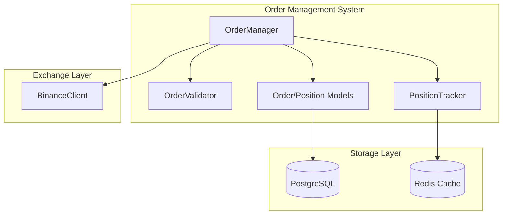

# Order Management System API Documentation

## Overview

The Order Management System provides complete order lifecycle management for the Helios Trading Bot. It enables placing, tracking, and managing orders on the Binance exchange with comprehensive validation, position tracking, and audit trail capabilities.

## Components

### 1. Order Models (`src/trading/order_models.py`)

#### Order Class

Represents a trading order with full lifecycle tracking.

```python
from src.trading import Order, OrderSide, OrderType, OrderStatus
from decimal import Decimal

# Create a limit buy order
order = Order(
    symbol="BTCUSDT",
    side=OrderSide.BUY,
    order_type=OrderType.LIMIT,
    quantity=Decimal("0.1"),
    price=Decimal("50000"),
)

# Access order properties
print(order.order_id)           # HLO-20250628120000-abc123def456
print(order.status)             # OrderStatus.PENDING
print(order.notional_value)     # Decimal("5000")
print(order.is_active)          # True
```

**Order Statuses:**
- `PENDING`: Created but not submitted
- `SUBMITTED`: Sent to exchange
- `OPEN`: Acknowledged by exchange
- `PARTIALLY_FILLED`: Partially executed
- `FILLED`: Fully executed
- `CANCELLED`: Cancelled by user/system
- `REJECTED`: Rejected by exchange
- `EXPIRED`: Time-in-force expired

#### Position Class

Represents an open trading position with P&L tracking.

```python
from src.trading import Position, PositionSide
from decimal import Decimal

# Create a long position
position = Position(
    symbol="BTCUSDT",
    side=PositionSide.LONG,
    quantity=Decimal("0.5"),
    entry_price=Decimal("50000"),
)

# Update current price
position.update_price(Decimal("52000"))

# Access P&L
print(position.unrealized_pnl)         # Decimal("1000")
print(position.unrealized_pnl_percent) # Decimal("4")
```

### 2. Order Validator (`src/trading/order_validator.py`)

Pre-order validation with comprehensive checks.

```python
from src.trading import OrderValidator, Order, OrderSide, OrderType
from decimal import Decimal

validator = OrderValidator()

order = Order(
    symbol="BTCUSDT",
    side=OrderSide.BUY,
    order_type=OrderType.LIMIT,
    quantity=Decimal("0.01"),
    price=Decimal("50000"),
)

result = validator.validate_order(
    order,
    available_balance=Decimal("1000"),
    current_price=Decimal("50000"),
)

if result.is_valid:
    print("Order is valid")
else:
    print(f"Validation errors: {result.errors}")
```

**Validation Checks:**
- Symbol validity and trading status
- Quantity bounds (min/max/step)
- Price bounds and tick size
- Balance sufficiency with 5% safety buffer
- Minimum notional value

### 3. Order Manager (`src/trading/order_manager.py`)

Complete order lifecycle management.

```python
from src.trading import OrderManager, OrderSide, OrderType
from src.api.binance_client import BinanceClient
from src.core.config import TradingConfig
from decimal import Decimal

# Initialize
config = TradingConfig(...)
client = BinanceClient(config)
manager = OrderManager(client, config)

# Initialize (loads symbol info)
await manager.initialize()

# Place a limit order
order = await manager.place_order(
    symbol="BTCUSDT",
    side=OrderSide.BUY,
    quantity=Decimal("0.01"),
    order_type=OrderType.LIMIT,
    price=Decimal("50000"),
)

# Cancel an order
await manager.cancel_order(order.order_id)

# Get open orders
open_orders = manager.get_open_orders(symbol="BTCUSDT")

# Sync order status with exchange
await manager.sync_order_status(order.order_id)
```

### 4. Position Tracker (`src/trading/position_tracker.py`)

Real-time position tracking with P&L calculations.

```python
from src.trading import PositionTracker, Order, OrderSide, OrderType
from decimal import Decimal

tracker = PositionTracker()

# Process a fill
buy_order = Order(
    symbol="BTCUSDT",
    side=OrderSide.BUY,
    order_type=OrderType.MARKET,
    quantity=Decimal("1.0"),
)

tracker.process_fill(buy_order, Decimal("1.0"), Decimal("50000"))

# Update market prices
tracker.update_price("BTCUSDT", Decimal("52000"))

# Get portfolio summary
summary = tracker.get_portfolio_summary()
print(f"Total P&L: {summary['total_pnl']}")
print(f"Net P&L: {summary['net_pnl']}")
```

## Database Schema

### Orders Table

```sql
CREATE TABLE helios_trading.orders (
    order_id VARCHAR(50) PRIMARY KEY,
    symbol VARCHAR(20) NOT NULL,
    side VARCHAR(4) NOT NULL,          -- BUY, SELL
    order_type VARCHAR(15) NOT NULL,   -- MARKET, LIMIT, STOP_LIMIT
    quantity DECIMAL(20, 8) NOT NULL,
    price DECIMAL(20, 8),
    stop_price DECIMAL(20, 8),
    status VARCHAR(20) NOT NULL,
    time_in_force VARCHAR(10) DEFAULT 'GTC',
    filled_quantity DECIMAL(20, 8) DEFAULT 0,
    average_fill_price DECIMAL(20, 8),
    commission DECIMAL(20, 8) DEFAULT 0,
    commission_asset VARCHAR(10),
    exchange_order_id VARCHAR(50),
    created_at TIMESTAMPTZ NOT NULL,
    updated_at TIMESTAMPTZ NOT NULL
);
```

### Positions Table

```sql
CREATE TABLE helios_trading.positions (
    id SERIAL PRIMARY KEY,
    symbol VARCHAR(20) NOT NULL UNIQUE,
    side VARCHAR(5) NOT NULL,          -- LONG, SHORT, FLAT
    quantity DECIMAL(20, 8) NOT NULL,
    entry_price DECIMAL(20, 8) NOT NULL,
    current_price DECIMAL(20, 8) NOT NULL,
    realized_pnl DECIMAL(20, 8) DEFAULT 0,
    total_commission DECIMAL(20, 8) DEFAULT 0,
    opened_at TIMESTAMPTZ NOT NULL,
    updated_at TIMESTAMPTZ NOT NULL
);
```

### Order History Table

```sql
CREATE TABLE helios_trading.order_history (
    id SERIAL PRIMARY KEY,
    order_id VARCHAR(50) NOT NULL REFERENCES orders(order_id),
    status VARCHAR(20) NOT NULL,
    changed_at TIMESTAMPTZ NOT NULL,
    details JSONB
);
```

## Exceptions

### Trading Exceptions Hierarchy

```
TradingError
├── OrderValidationError
│   ├── InsufficientBalanceError
│   ├── InvalidSymbolError
│   ├── OrderQuantityError
│   └── OrderPriceError
├── RiskLimitExceeded
│   ├── DrawdownLimitExceeded
│   ├── DailyLossLimitExceeded
│   └── PositionLimitExceeded
├── OrderExecutionError
├── OrderNotFoundError
├── OrderCancellationError
└── PositionError
```

## Financial Safety (Rule 010)

All monetary calculations use `Decimal` type for precision:

```python
# Correct: Using Decimal
quantity = Decimal("0.00123456")
price = Decimal("50000.12345678")
notional = quantity * price  # Preserves full precision

# Incorrect: Using float (precision loss)
quantity = 0.00123456  # May lose precision
```

**Validation Rules:**
- 5% balance safety buffer on all orders
- Symbol validity check against exchange
- Quantity/price precision validation
- Minimum notional value enforcement

## Testing

Unit tests are provided for all components:

```bash
# Run order management tests
pytest tests/unit/test_order_models.py -v
pytest tests/unit/test_order_validator.py -v
pytest tests/unit/test_order_manager.py -v
pytest tests/unit/test_position_tracker.py -v
```

**Test Coverage:**
- Order model lifecycle (30 tests)
- Validation rules (27 tests)
- Order manager operations (13 tests)
- Position tracking and P&L (23 tests)

## Architecture Diagram



## Usage Examples

### Complete Order Flow

```python
import asyncio
from decimal import Decimal
from src.trading import OrderManager, PositionTracker, OrderSide, OrderType
from src.api.binance_client import BinanceClient
from src.core.config import TradingConfig

async def main():
    # Setup
    config = TradingConfig(validate_on_init=False)
    client = BinanceClient(config)
    manager = OrderManager(client, config)
    tracker = PositionTracker()

    await manager.initialize()

    # Place buy order
    order = await manager.place_order(
        symbol="BTCUSDT",
        side=OrderSide.BUY,
        quantity=Decimal("0.01"),
        order_type=OrderType.LIMIT,
        price=Decimal("50000"),
    )
    print(f"Order placed: {order.order_id}")

    # Simulate fill
    tracker.process_fill(
        order,
        fill_quantity=Decimal("0.01"),
        fill_price=Decimal("50000"),
        commission=Decimal("0.01"),
    )

    # Check position
    position = tracker.get_position("BTCUSDT")
    print(f"Position: {position.quantity} @ {position.entry_price}")

    # Update price and check P&L
    tracker.update_price("BTCUSDT", Decimal("51000"))
    print(f"Unrealized P&L: {position.unrealized_pnl}")

if __name__ == "__main__":
    asyncio.run(main())
```

## Version History

| Version | Date | Changes |
|---------|------|---------|
| 1.0.0 | 2025-06-28 | Initial implementation |
